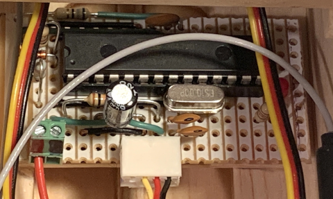

# FlySky i.BUS voltage sensor

FlySky-compatible i.BUS voltage sensor implemented in an AVR ATmega328P. For use only with 3S and 4S LiPo batteries.

```
+---------+                +------------+
| AVR     |                |            |
| ATmega  |                | FS-iA6B    |
| 328P    |                | receiver   |
|         |  Diode         |            |
| Ser Tx  |---|<---+       |            |
|         |        |       | i.bus      |
| Ser Rx  |--------+-------| sensor     |
+---------+                +------------+
```

Sensor prototype installed in a SIG FourStar 20EP RC plane: 



## Files

- ibusvsense.c        -- Main sesnor module source code
- sensor_type.h       -- i.bus sensor types
- uart_hduplex_drv.*  -- Half-duplex serail driver
- ibus_drv.*          -- Header and source for i.bus serial driver
- util.*              -- Utility functions
- test/               -- Some test code in Python
- doc/                -- Schematic and image

## Resources

[Single wire FlySky I.Bus telemetry](https://github.com/betaflight/betaflight/wiki/Single-wire-FlySky-(IBus)-telemetry)


